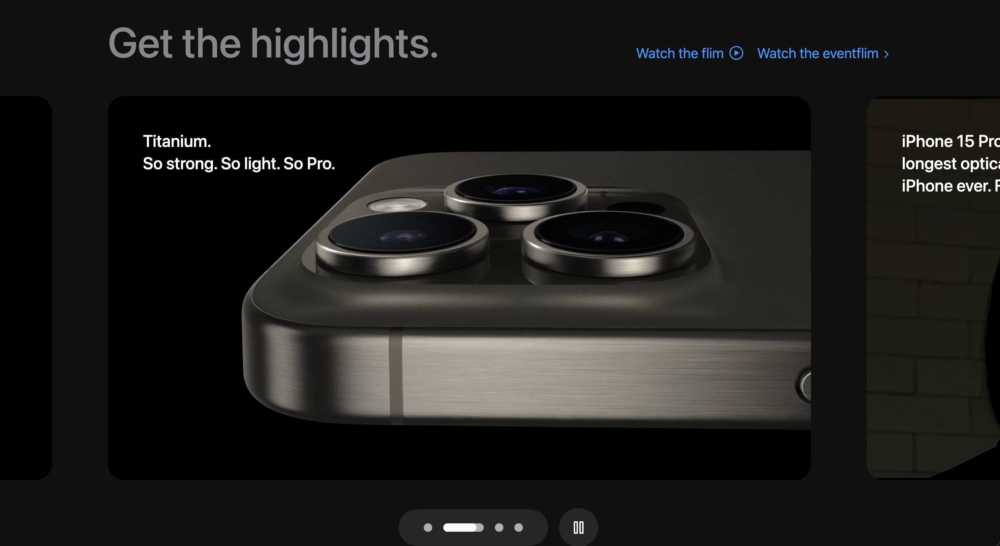
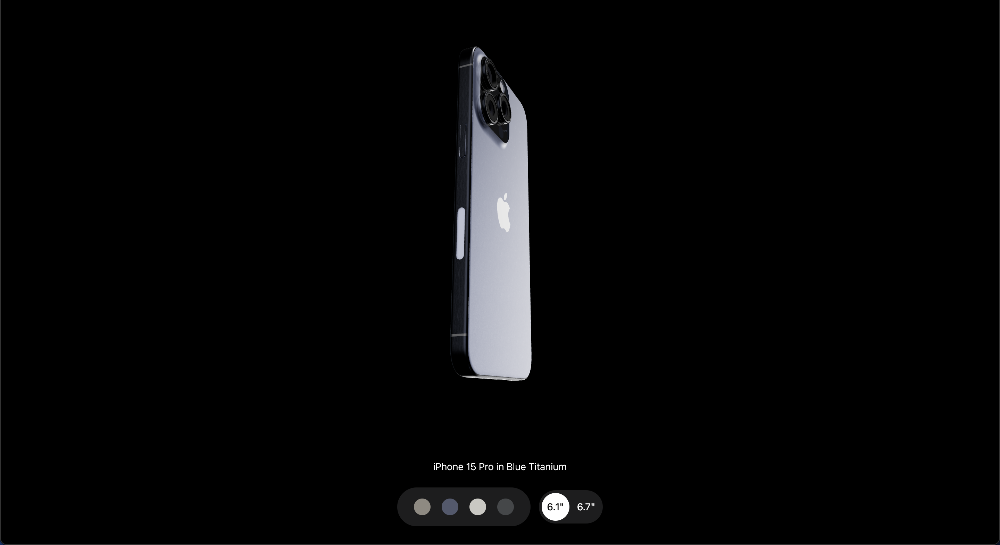

📱 iPhone 15 Pro Clone Website
An interactive clone of Apple’s iPhone 15 Pro website built with React, GSAP, and Three.js to deliver a sleek and engaging user experience.

🌐 Live Demo
View the project on Vercel - https://maydev-3d-iphone-website.vercel.app

🚀 Features

- 3D Model: Explore an interactive iPhone model with color and shape variations.
- Smooth Animations: GSAP-powered animations for a seamless, visually appealing experience.
- Responsive Design: Optimized for mobile and desktop.

🛠 Tech Stack

- React.js
- Tailwind CSS
- GSAP
- Three.js

📘 What I Learned
💡 GSAP Animations: Mastered the basics of creating smooth, engaging animations.
💡 Three.js: Gained hands-on experience with 3D modeling for the web.
💡 Apple-like UI Design: Developed skills for creating attractive, interactive UI similar to Apple’s style.
💡 Lelvel up UI Development skill: Enhanced proficiency in building seamless interfaces using React, TailwindCSS and GSAP animation.

📸 Screenshots

- Animated Video Slider Section
  

- 3D Model Section
  

View the full project on live 🌐 - https://maydev-3d-iphone-website.vercel.app

🙏 Acknowledgements
Thanks to #JS Mastery for the guidance and tutorial that inspired this project.
